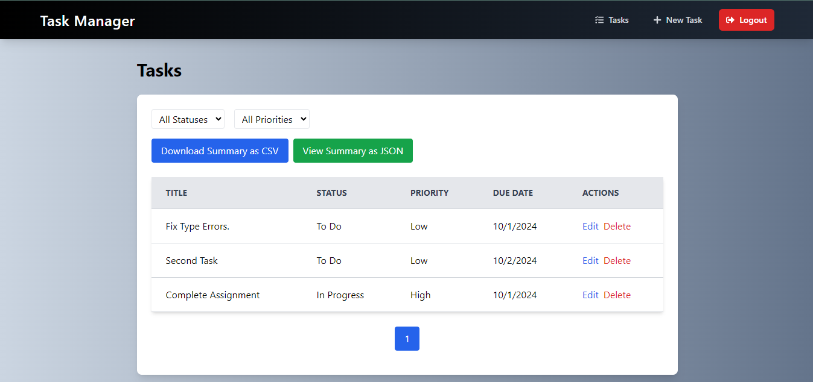
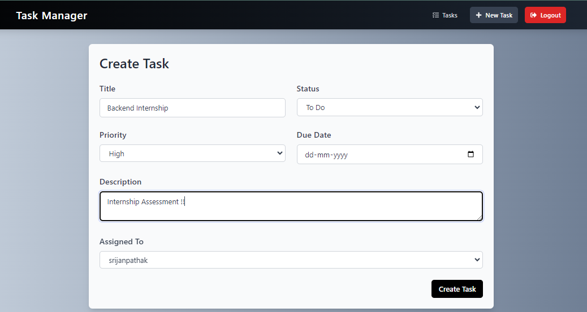

# Task Management Application

This is a Task Management Application built as part of an assignment for Torus Innotech Pvt. Ltd. The app is built using the MERN (MongoDB, Express, React, Node.js) stack and provides features such as user authentication, task creation, assignment, status tracking, and task summary reports.

Live - https://task-management-assignment-mu.vercel.app

## Admin Credentials 🛡️🔑

To access admin functionality, use the following credentials:

- **Email:** admin@example.com
- **Password:** adminpassword123

## Screenshots

### Task Dashboard

### Create New Task

## Features

### User Authentication
- JWT-based authentication.
- Secure password storage using hashing.
- Users can register, log in, and log out.

### Task Management
- Users can create, update, and delete tasks.
- Tasks have the following fields:
  - Title
  - Description
  - Due Date
  - Status ("To Do", "In Progress", "Completed")
  - Assigned User
  - Priority (Low, Medium, High)
- Users can view their tasks in a paginated task list.
- Search and filtering options are available based on status, priority, or assigned users.

### Task Assignment
- Admin users can assign tasks to other registered users.
- Non-admin users can only see tasks they created or tasks assigned to them.

### Task Summary Report
- API endpoint to generate task summary reports based on different filters (status, user, date).
- Reports can be returned as JSON or CSV.
